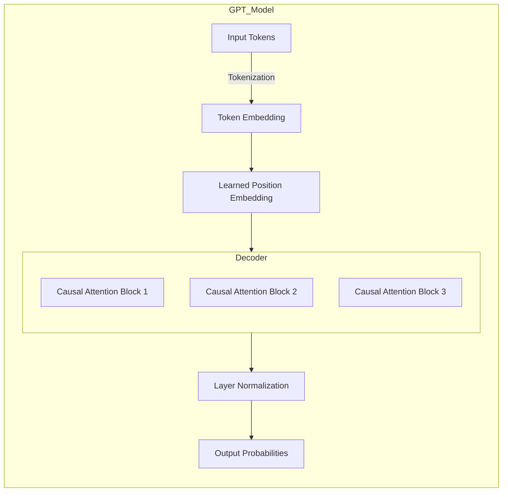

# 🚀 General Pretrained Transformer (GPT)

## 📌 Key Differences from the Original Transformer

Unlike the original Transformer architecture (used in tasks like machine translation with encoder-decoder setups), **GPT** was designed specifically for **auto-regressive text generation**. Here's how GPT diverges:

### 🔒 Causal Attention (Masked Self-Attention)

- **What**: GPT's attention mechanism is **causal**, meaning **only past and current tokens** are attended to — never future tokens.
- **Why**: In generation tasks, predicting the next word must not "peek" ahead.
- **How**: Future tokens are masked with a triangular matrix during attention score calculation.

---

### 🏗️ Decoder-Only Architecture

- **What**: GPT eliminates the need for a separate encoder. It is purely **decoder-only**.
- **Why**: For language generation, there’s no source sequence to encode — just an unfolding prediction sequence.
- **How**: A stack of transformer decoder layers handles both feature extraction and generation simultaneously.

---

### 🎯 Learnable Positional Embeddings (Instead of Positional Encodings)

- **What**: GPT uses **learnable** positional embeddings rather than **fixed sinusoidal** encodings.
- **Why**: Learnable embeddings allow the model to optimize how it represents position information during training.
- **How**: Each position index is mapped to a learned vector that's added to the token embeddings.

---

### 🛑 No Masked Language Modeling (MLM)

- **What**: GPT does **not** mask random tokens during pretraining.
- **Why**: GPT is trained to **always** predict the next token, enforcing sequential dependency.
- **How**: It uses **Causal Language Modeling (CLM)** — optimizing for predicting token *i+1* based on tokens 1 through *i*.

---

## 🧱 GPT Architecture

Here’s the structural breakdown of GPT:

| Component            | Purpose |
|----------------------|---------|
| Token Embedding       | Converts each token into a dense vector. |
| Position Embedding    | Adds positional information into each token vector. |
| Decoder Stack         | Series of causal attention and feed-forward layers. |
| Layer Normalization   | Stabilizes the training and output distribution. |
| Output Linear Layer   | Maps hidden states to vocabulary logits. |

---

### 🛠 Architecture Diagram

# 📚 GPT Model Architecture Explanation (Stage-by-Stage)

## 1. **Input Tokens**

- **What**: Raw text input provided by the user (e.g., `"The cat sat on the mat."`).
- **How**: Text is **split** into discrete tokens (subwords, words, or characters depending on tokenizer).
- **Why**: Deep learning models cannot directly process text — they work with numbers.

---

## 2. **Tokenization**

- **What**: The input text is **converted into a sequence of token IDs**.
- **How**: A pretrained tokenizer (like `GPT2Tokenizer`) maps each word/subword to a unique integer.
- **Why**: Transform human language into a machine-readable format (numerical IDs).

✅ Example:
> `"The cat sat"` → `[464, 3290, 922]`  
(*IDs are arbitrary examples*)

---

## 3. **Token Embedding**

- **What**: Each token ID is **mapped to a high-dimensional learned vector**.
- **How**: Through an embedding matrix of size (vocab_size, embedding_dim).
- **Why**: To capture semantic meaning of words — "king" and "queen" are closer in vector space.

✅ Mathematically:
> `Token_ID x Embedding_Matrix` → Dense Vector Representation

---

## 4. **Learned Position Embedding**

- **What**: Adds a **position-specific vector** to each token embedding.
- **How**: Lookup position embeddings and **add** to token embeddings.
- **Why**: Transformers are permutation invariant — position embeddings **inject order information**.

✅ Example:
> First word gets **position 0 vector**, second word gets **position 1 vector**, etc.

---

## 5. **Decoder: Stack of Causal Attention Blocks**

- **What**: Main body of GPT, made up of **multiple stacked blocks** (e.g., 12 for GPT-2 Small).
- **Each Block Includes**:
  - **Causal Multi-Head Attention**:
    - Only attends to previous tokens (prevents seeing the "future").
  - **Feed Forward Network (MLP)**:
    - Non-linear transformation applied independently to each position.
  - **Residual Connection + LayerNorm**:
    - Helps stabilize training and preserve input signal.

✅ **Causal Masking** inside Attention:
> Prevents token *i* from attending to *i+1, i+2, ...*  
(look only "backward")

---

## 6. **Layer Normalization**

- **What**: After the decoder stack, **normalize the output activations**.
- **How**: For each token, standardize the vector's values (mean = 0, variance = 1).
- **Why**: Improves training stability, enables deeper models.

✅ Formula:
> \( \text{LayerNorm}(x) = \frac{x - \mu}{\sqrt{\sigma^2 + \epsilon}} \times \gamma + \beta \)

---

## 7. **Output Probabilities**

- **What**: Apply a **linear projection** followed by **softmax** over vocabulary.
- **How**: Maps the decoder output into logits, then probability distribution over possible next tokens.
- **Why**: To sample or pick the next token with the highest likelihood.

✅ Example Output:
> [dog: 0.1, cat: 0.05, sat: 0.7, mat: 0.05, etc.]

---

# 🎯 High-Level Summary of Flow:

| Stage                    | Purpose                          |
|---------------------------|----------------------------------|
| Input Tokens              | User provides raw text          |
| Tokenization              | Convert text → token IDs        |
| Token Embedding           | Turn tokens into dense vectors  |
| Position Embedding        | Add order information           |
| Decoder (Causal Attention + FFN) | Predict next token sequentially |
| LayerNorm                 | Stabilize activations           |
| Output                    | Predict next word/token         |

---

## 🧩 Inside Each Decoder Block: Stacked Causal Attention Layers

Each decoder block in GPT consists of:

### 🔒 Causal Multi-Head Attention

- **What**: Splits the input into multiple attention heads.
- **Why**: Allows the model to capture different contextual patterns in parallel.
- **How**: Applies causal masking to ensure no forward-looking.

---

### 🔥 Feed Forward Networks (FFN)

- **What**: A two-layer MLP (with GeLU activation).
- **Why**: Introduces non-linear transformations after attention mixing.
- **How**: Increases the model’s capacity to represent complex token relationships.

---

### 📏 Layer Normalization

- **What**: Applies normalization after causal attention and feed-forward networks.
- **Why**: Helps stabilize training by keeping inputs centered and scaled properly.
- **How**: Reduces internal covariate shift, enabling deeper stacking of layers.

---

## 🧮 Layer Normalization Mathematical Formulation

LayerNorm ensures each hidden state is rescaled and shifted:

$$
\text{LayerNorm}(x) = \frac{x - \mu}{\sqrt{\sigma^2 + \epsilon}} \odot \gamma + \beta
$$

Where:

| Symbol         | Meaning                                                      |
|----------------|---------------------------------------------------------------|
| \(x\)          | Input tensor (hidden states).                                 |
| \(\mu\)        | Mean of elements in \(x\).                                     |
| \(\sigma^2\)   | Variance of elements in \(x\).                                 |
| \(\epsilon\)   | Small constant to prevent division by zero.                   |
| \(\odot\)      | Element-wise multiplication.                                  |
| \(\gamma\)     | Learnable scale parameter.                                    |
| \(\beta\)      | Learnable shift parameter.                                    |

---

## ⚡ Quick Summary: BERT vs GPT

| Aspect                 | BERT                            | GPT                               |
|-------------------------|----------------------------------|-----------------------------------|
| Architecture            | Encoder-Decoder (or Encoder)    | Decoder-only                     |
| Attention               | Bidirectional                   | Causal (unidirectional)           |
| Language Modeling Task  | Masked Language Modeling (MLM)  | Causal Language Modeling (CLM)    |
| Positional Representation | Fixed Sinusoidal Encoding     | Learnable Position Embeddings     |
| Use Case Focus          | Classification, QA, Embeddings  | Generation, Autoregressive Tasks  |

---

## 📚 Further Reading

- [Attention Is All You Need (Vaswani et al., 2017)](https://arxiv.org/abs/1706.03762)
- [Improving Language Understanding by Generative Pretraining (GPT Paper)](https://cdn.openai.com/research-covers/language-unsupervised/language_understanding_paper.pdf)
- [Illustrated GPT Architecture](https://jalammar.github.io/illustrated-gpt2/)
